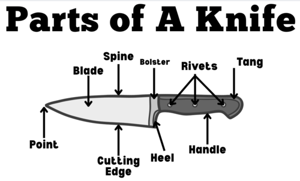
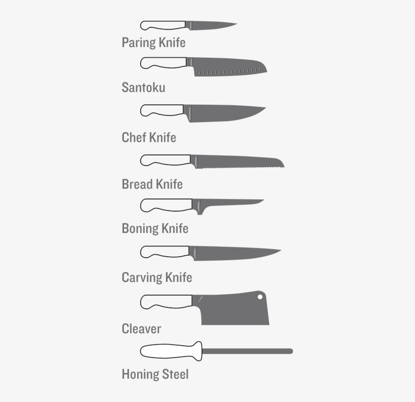
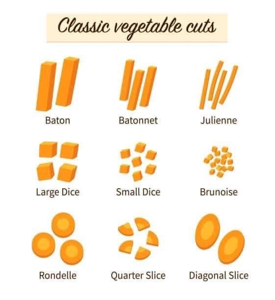

#### Carolina Raudales
#### Period 3

### Subject: Culinary 1 

# Knife safety & Skills

## **Knife Safety**
1. **A sharp knife is a safe knife**. Using a dull knife is an invitation to disaster.If you try to force a dull knife through the surface of a food product, it's more likely to slip and cause an injury.Also if you do happen to cut yourself,a sharp knife will result in a easier wound to attend to

1. **Never,ever grab a falling knife** The best way to avoid having to think about this rule is to make sure your knife is always completely on your work surface,without the handle sticking out.We all have a natural instict to grab for anything thats falling.Just get your hands and feet out of the way.

1. **Use the right knife for the right job.** Many knife injuries occur when laziness induces us to use the knife a hand rather than the correct knife for the job.

1. **Always cut away from-never towards-yourself** Sometimes this is a hard rule to follow.If your cutting board doesn't have rubber feet,you should place it on top of a damp towel to make sure it doesn't move while you're cutting.

1. **When you have knife in hand,keep your eyes on the blade**
This rule stand weather you are cutting something or carrying a knife.You're unlikely to cut yourself if you're watching the blade,especially the tip.

1. **Carry a knife properly.** The only way to walk with a knife in hand is to carry it pointed straight down,with the blade turned towards your thigh.Keep your arm rigid.

1. **Never ever put a knife in a sink full of water** Putting a knife in a sink full of water especially soapy water is just asking for trouble.Wash your sharp knifes by hand and put them away immediately.

1. **Always cut on a cutting board** NEVER on wooden tables.Don't cut on metal,glass or marble because it will damage a knife's edge.

It is important to know the parts of a knife.The parts include:
- tip
- back
- bolster
- rivets 
- tang 
- point
- cutting edge
- heel
- handle

# Types Of Knifes

| Chef's Knife | Bread Knife| Paring Knife | Cleaver | Boning Knife | Carving Knife|
|--------------| -----------|--------------| --------| -------------| -------------|
|Commonly used, perfect for dicing slicing,& chopping | Long blades and serrated edges to cut through bread,fluffy cakes, or softer meats | For precise task like finely slice smaller foods | Slicing through thick meat like ribs or cutting poultry bones | Remove bones from raw meats and butterflying pork chops & chicken breasts| Narrow blades with pointed tip,to carve meats like thanksgiving turkey or ham.

## Types of cuts 

- Baton
- Batonnet
- Julienne 
- Large Dice 
- Small Dice 
- Brunoise
- Rondelle 
- Quarter slice 
- Diagonal slice 

## Measurements for cuts

| Large dice | Medium Dice | Small Dice | Brunoise | Batonnet | Julienne |Rondelle | Ollique |
|------------|-------------|------------|----------|----------|----------|---------|---------|
|3/4 x 3/4 x 3/4| 1/2 x 1/2 x 1/2 | 1/4 x 1/4 x 1/4 | 1/8 x 1/8 x 1/8 | 1/4 x 1/4 x 2-3 | 1/8 x 1/8 x 1-2 | Round cut of varied width & thickness | Rondelle cut but with 90 degree turn on each end to make a diagonal cut